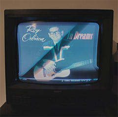

# cover_display

*cover_display* is a simple Python script which displays covers of albums
you are currently listening via *Spotify*.

I use it to display the cover art on an old television via the S-Video output of a *Raspberry Pi*. 



## Installation on *raspbian*

The following steps assume that you have a terminal or ssh session to your
*Raspberry Pi* available.

Make sure you have *python3*, *pip3*, *git* and *fbi* (which will display our images) installed via

```shell script
sudo apt-get update
sudo apt-get install python3 python3-pip git fbi
```

Using the non-lite version of *raspbian* these are already installed.

Now install the python library *requests* via

```shell script
pip3 install --user requests
```

Now clone the git repo to your raspberry pi via

```shell script
git clone https://github.com/capital-G/cover_display.git
cd cover_display
```

Now we need to configure the *Spotify* credentials as environment
variables and we will also make *cover_display* start at booting.

Edit your ``.bashrc`` file via e.g. ``nano ~/.bashrc`` and append the following lines
to the bottom

```shell script
export SPOTIFY_CLIENT_ID='YOUR CLIENT ID'
export SPOTIFY_CLIENT_SECRET='YOUR CLIENT SECRET'
export SPOTIFY_REFRESH_TOKEN='YOUR REFRESH TOKEN'

python3 ~cover_display.py
```

The downside on this approach is that every time somebody logs into
your bash the *cover_display* service will start but you can still ssh
onto your *Raspberry Pi* and hit ``Ctrl + C`` to stop the execution of *cover_display*
and continuing to log into a bash session.

The benefit of this approach is that on startup of the *Raspberry Pi* it will
start displaying the cover without any additional setup.

Attach the display to your *Raspberry Pi* and make sure you have set up
an internet connection. Then just restart the *Raspberry Pi* via

```shell script
sudo reboot
```

and it should start to display the album art of what you are listening on Spotify.
